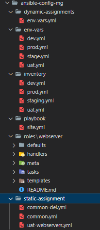
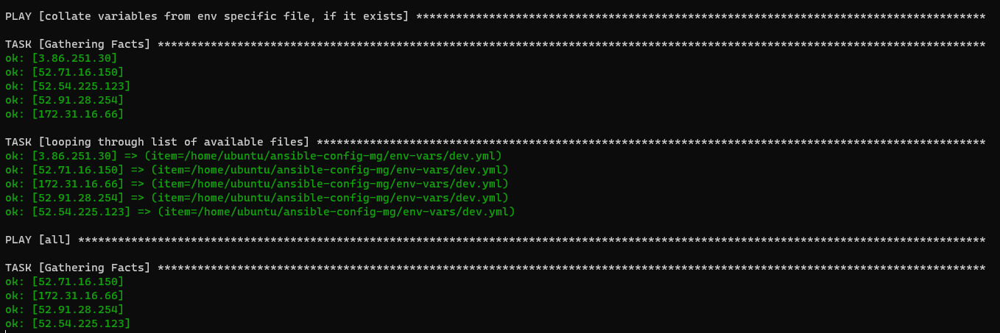
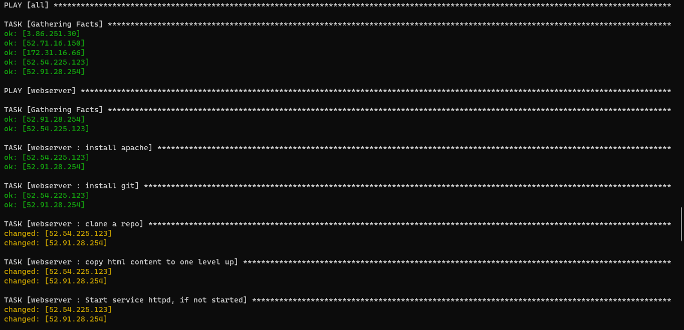
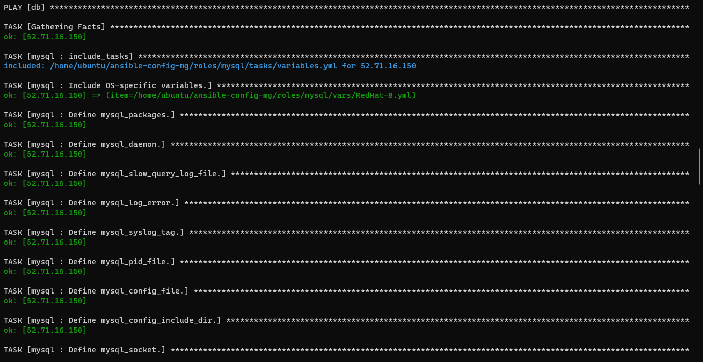

# DOCUMENTATION OF PROJECT 13

This project willll be an upgrade from project 11 and 12.
In this project we will introduce dynamic assignments by using include module.

Firstly in our github repository we'll start a new branch and name it dynamic assignment.

Now we create a new folder, name it dynamic-assignments. Then inside this folder, create a new file and name it env-vars.yml. 

Since we will be using the same Ansible to configure multiple environments, and each of these environments will have certain unique attributes, we will need a way to set values to variables per environment.

For this we create a new folder to keep each enviroment variables  `mkdir env-vars` that command created a folder named env-vars.

Then for each enviroment we create new .yml files




The above image shows our file structure after all changes.

Now we paste the code below into the env-vars.yml file 

```
---
- name: collate variables from env specific file, if it exists
  hosts: all
  tasks:
    - name: looping through list of available files
      include_vars: "{{ item }}"
      with_first_found:
        - files:
            - dev.yml
            - stage.yml
            - prod.yml
            - uat.yml
          paths:
            - "{{ playbook_dir }}/../env-vars"
      tags:
        - always
```

Now we are moving to the next step updating site.yml with dynamic assignments.

Now your site.yml file should like this 
```
---
- hosts: all
- name: Include dynamic variables 
  tasks:
  import_playbook: ../static-assignments/common.yml 
  include: ../dynamic-assignments/env-vars.yml
  tags:
    - always

-  hosts: webservers
- name: Webserver assignment
  import_playbook: ../static-assignments/webservers.yml
```

Now its time to create a role for mysql database. We can download from the ansible galaxy.We will be using a MySQL role developed by geerlingguy.

On Jenkins-Ansible server make sure that git is installed with `git --version` then go to ‘ansible-config-mgt’ directory and run the commands below
```
git init
git pull https://github.com/<your-name>/ansible-config-mgt.git
git remote add origin https://github.com/<your-name>/ansible-config-mgt.git
git branch roles-feature
git switch roles-feature
```

Now we go back to roles directory and create our new mysql role. `ansible-galaxy install geerlingguy.mysql` and rename the folder to mysql. using the command `mv geerlingguy.mysql mysql`

Read README.md file, and edit roles configuration to use correct credentials for MySQL required for the tooling website.

Push your changes to git and move to the next step.

Now we are moving to the complex parts. we are going to be installing and configuring our load balancer roles.

We want to be able to choose which Load Balancer to use, Nginx or Apache, so we need to have two roles respectively

So we download our roles from ansible galaxy and configure it to fit our configurations.

now we make use of variables since we cant make use of both load balancer at once .

Declare a variable in the defaults/main.yml of each load balancer. Name each variables enable_nginx_lb and enable_apache_lb respectively.
Set both values to false.

Now declare another variable in both roles `load_balancer_is_required` and set its value to false as well.

Now we update both static-assignment and site files respectively

Input the code below into loadbalancer.yml file 
```
- hosts: lb
  roles:
    - { role: nginx, when: enable_nginx_lb and load_balancer_is_required }
    - { role: apache, when: enable_apache_lb and load_balancer_is_required }
```

Input the code below into site.yml file 
```
  - name: Loadbalancers assignment
       hosts: lb
         - import_playbook: ../static-assignments/loadbalancers.yml
        when: load_balancer_is_required 
```

Now you can make use of env-vars\uat.yml file to define which loadbalancer to use in UAT environment.

You will activate load balancer, and enable nginx by setting these in the respective environment’s env-vars file.

Input this in the uat.yml file
```
enable_nginx_lb: true
load_balancer_is_required: true
```
To test this, you can update inventory for each environment and run Ansible against each environment.
 
 

 

 